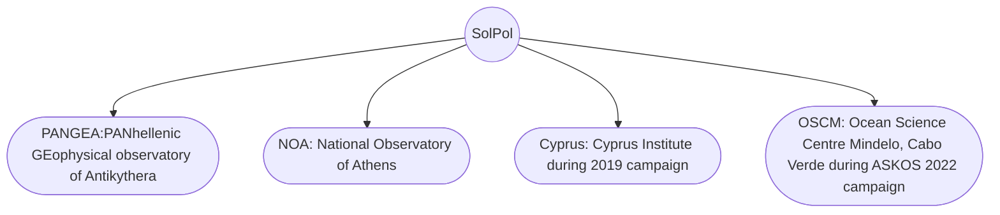

# SolPol
Instrument manual and data processing algorithm for the NOA/UH - Solar Polarimeter (SolPol)

This repository contains everything related to the operation, characterization and data manipulation of the SolPol - Solar polarimeter, as operated by the NOA-ReACT team. The instrument was conferred to the National Observatory of Athens by the University of Hertfordshire in the framework of the [D-TECT](https://d-tect.space.noa.gr)/ERC project.

**General info**:
- is a passive polarimetric ground-based instrument that targets directly the Sun
- has measuring capabilities of a few parts per million (ppms) in linear polarization and of the order of $10^{-7}$ in circular polarization
- is based on the existing design of the PlanetPol high sensitivity polarimeter as described in [Hough et al., 2006](https://iopscience.iop.org/article/10.1086/507955)
- usage under laboratory conditions is described by [Martin et al., 2010](https://www.sciencedirect.com/science/article/abs/pii/S0022407310002803)

### Operation
- Extensive measurements and tests between August 2018 to November 2022

- Locations: 

## Index

In this repository you can find:
- `solpol_data.py`: a python 3.7-based code for processing the raw data retrieved from the instrument
- `drivers`: the drivers for each peripheral component required for the operation of SolPol
- `manual`: a complete guide for the instrument set-up, initialization and measurement sequence
- `test_data`: includes a test data file and data format description

## Acknowledgements
This research was supported by D-TECT (Grant Agreement 725698) funded by the European Research Council (ERC) under the European Union's Horizon 2020 research and innovation programme.

The PhD thesis that includes research presented in this repository is co financed by Greece and the European Union (European Social Fund ESF) through the Operational Programme «Human Resources Development, Education and Lifelong Learning» in the context of the project “Strengthening Human Resources Research Potential via Doctorate 
Research” (MIS 5000432), implemented by the State Scholarships Foundation (ΙΚΥ)».

## Blame

- **Team lead**: Lilly Daskalopoulou <vdaskalop@noa.gr> @ModusElectrificus
- **Research consultant**: Alexandra Tsekeri <atsekeri@noa.gr>
- **Instrument operator**: Panagiotis-Ioannis Raptis <piraptis@meteo.noa.gr>
- **Instrument PI**: Vassilis Amiridis <vamoir@noa.gr>
- **Consulting**: Thanasis Georgiou <ageorgiou@noa.gr> @thgeorgiou

