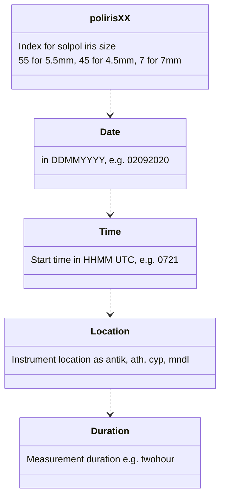

# SolPol Data format

In order to properly read raw SolPol data with the `solpol_data.py`, use the following naming convension:

❗ In (`test_data/`) there is a two-hour measurement test file as poliris55\_02092020\_0721\_antik\_twohour.txt.

## Header
The raw data `header` is:

SOLAR POLARIMETER

1. `Polarimeter Position [deg]`:
Instrument rotational position at 0 and 45 degrees from reference

2. `Rotator Position [deg]`:
Polarizer position in sets of [0, 40, 130, 220, 310] in degrees

3. `PEM Setting [nm]`:
Photoelastic Modulator Head operating wavelength, default 550nm

4. `Retardation [waves]`:
PEM induced retardation

5. `Wavelength Filter (Wavelength-Bandwidth)`:
Filter wheel filter selection, default 550nm

6. `ND-Filter`:
Neutral density 0.3 filter (pre-defined)

7. `Time (UTC)`:
Measurement starting time in HH:MM:SS (UTC)

8. `Bias Voltage on Diode`
Should be zero if instrument working properly, forward bias

9. `LabJack, mean DC (AIN0)`:
DC output voltage from the DAQ in Volts

10. `LabJack, other`:
State zero if instrument works properly

11. `Lock-in, 1w`:
RMS Voltage output from channel 1 of the Lock-in amplifier, signal phase on resonant frequency (ω) in degrees

12. `Lock-in, 2w`:
RMS Voltage output from channel 2 of the Lock-in amplifier, signal phase on twice the resonant frequency (2ω) in degrees

## 🔴IMPORTANT🔴

❗ Data file to be valid needs to contain **5** sets of measurements [1-12 above] for each `Rotator Position [deg]` per `Polarimeter Position [deg]`.  

❗ Every valid file stops at a `Polarimeter Position [deg]` == 45 degs  & `Rotator Position [deg]` == 310.

## Zenodo repository folder content
Zenodo link: XXX

Each data folder includes the following for the individual locations of operation:

* `Data_Antikythera`: 
folder containing all the raw `.txt` data acquired by SolPol when installed in the **PANhellenic Geophysical Observatory of Antikythera - PANGEA**, Greece 

  **measurement period**: September 2018 to March 2022
  
  **location**: lat = 35.86099, long = 23.30982, alt = 193

  `\txt`: data acquired with default instrument aperture size (@5.5mm) labeled as pol_DDMMYYYY_HHMM(in UTC)_antik_duration.txt

  `\txt_iris`: data acquired with different aperture sizes (@4.5mm, 5.5mm and 7mm) labeled as _polirisXX_DDMMYYYY_HHMM(in UTC)_antik_duration_

  `\txt_dark`: closed aperture dark measurements labeled as _poldark_DDMMYYYY_HHMM(in UTC)_antik_duration_, either with instrument tracker not tracking (NT index) or   standard tracking (T index)

* `Data_Athens`: 
folder containing all the raw .txt data acquired by SolPol when installed in the **National Observatory of Athens (NOA)**, Athens, Greece 

  **measurement period**: 18/04/2020 to 14/05/2020

  **location**: lat = 37.966295, long = 23.710624, alt = 60

  `\txt`: data acquired with default instrument aperture size (@5.5mm) labeled as pol\_DDMMYYYY\_HHMM(in UTC)\_ath\_duration.txt

* `Data_Cyprus`: 
folder containing all the raw .txt data acquired by SolPol for the duration of the preliminary ASKOS 2019 campaign, in the **Cyprus Institute - Nicosia**, Cyprus

  **location**: lat = 35.14063, long = 33.38135, alt = 181

  `\txt`: data acquired with default instrument aperture size (@5.5mm) labeled as pol\_DDMMYYYY\_HHMM(in UTC)\_cyp1\_duration.txt

- `Data_Mindelo`: 
folder containing all the raw .txt data acquired by SolPol for the duration of the ASKOS 2022 campaign, in the **Ocean Science Centre Mindelo (OSCM) - Mindelo**, Cape Verde

  **location**: lat = 16.87775, long = -24.994889, alt = 20

  `\txt`: data acquired with default instrument aperture size (@5.5mm) labeled as poliris55\_DDMMYYYY\_HHMM(in UTC)\_mndl\_duration.txt

  `\txt_dark`: closed aperture dark measurements labeled as poldark\_DDMMYYYY\_HHMM(in UTC)\_mndl\_duration
