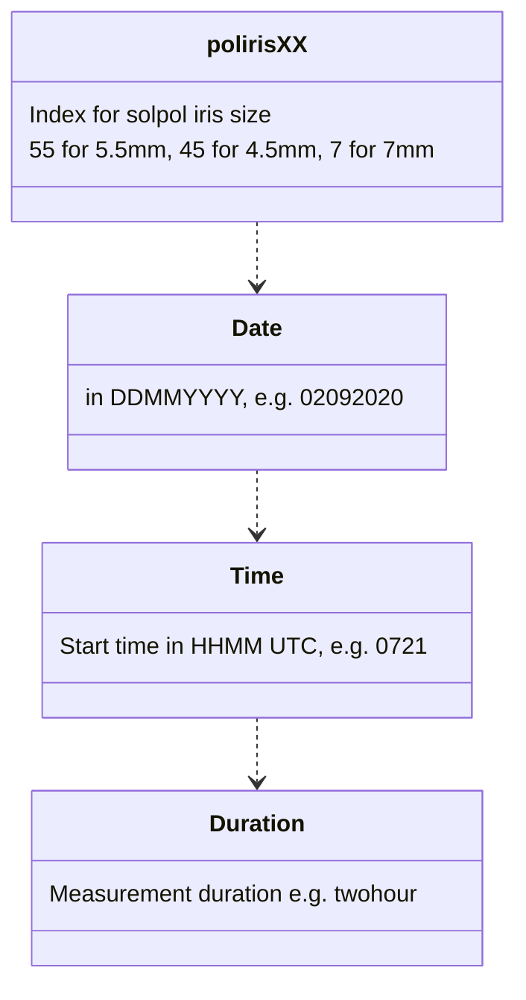

# SolPol Data format

In order to properly read raw SolPol data with the `solpol_data.py`, use the following naming convension:

In (`test_data\`) there is a two-hour measurement test file as *poliris55_02092020_0721_antik_twohour.txt*.

## Header
The raw data `header` is:

SOLAR POLARIMETER

1. `Polarimeter Position [deg]`:
Instrument rotational position at 0 and 45 degrees from reference

2. `Rotator Position [deg]`:
Polarizer position in sets of [0, 40, 130, 220, 310] in degrees

3. `PEM Setting [nm]`:
Photoelastic Modulator Head operating wavelength, default 550nm

4. `Retardation [waves]`:
PEM induced retardation

5. `Wavelength Filter (Wavelength-Bandwidth)`:
Filter wheel filter selection, default 550nm

6. `ND-Filter`:
Neutral density 0.3 filter (pre-defined)

7. `Time (UTC)`:
Measurement starting time in HH:MM:SS (UTC)

8. `Bias Voltage on Diode`
Should be zero if instrument working properly, forward bias

9. `LabJack, mean DC (AIN0)`:
DC output voltage from the DAQ in Volts

10. `LabJack, other`:
State zero if instrument works properly

11. `Lock-in, 1w`:
RMS Voltage output from channel 1 of the Lock-in amplifier, signal phase on resonant frequency (ω) in degrees

12. `Lock-in, 2w`:
RMS Voltage output from channel 2 of the Lock-in amplifier, signal phase on twice the resonant frequency (2ω) in degrees

## Data validity

! Data file to be valid needs to contain **5** sets of measurements [1-12 above] for each `Rotator Position [deg]` per `Polarimeter Position [deg]`.  

! Every valid file stops at a `Polarimeter Position [deg]` == 45 degs.

