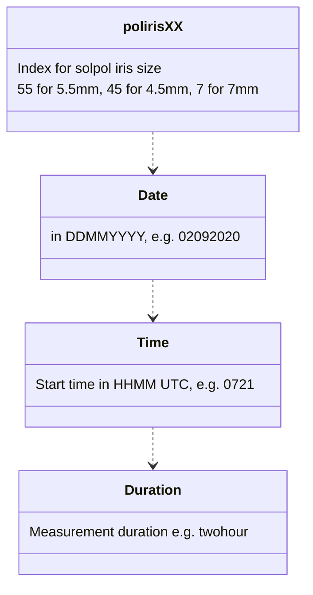

# SolPol Data format

In order to properly read raw SolPol data with the `solpol_data.py`, use the following naming convension:

The raw data header is:

SOLAR POLARIMETER

`1. Polarimeter Position [deg]`
instrument rotational position at 0 and 45 degrees from reference

`2. Rotator Position [deg]`
Polarizer position in sets of [0, 40, 130, 220, 310] in degrees

`3. PEM Setting [nm]`

`4. Retardation [waves]`

`5. Wavelength Filter (Wavelength-Bandwidth)`

`6. ND-Filter`

`7. Time (UTC)`

`8. Bias Voltage on Diode`

`9. LabJack, mean DC (AIN0)`

`10. LabJack, other`

`11. Lock-in, 1w`

`12. Lock-in, 2w`

